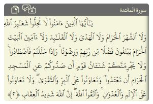

# Quran Madina Html (no-images)
[](https://github.com/tarekeldeeb/quran-madina-html/actions/workflows/github-code-scanning/codeql)
[](https://github.com/tarekeldeeb/quran-madina-html/actions/workflows/pylint.yml)
[](https://github.com/tarekeldeeb/quran-madina-html/actions/workflows/py_test.yml)
[](https://github.com/tarekeldeeb/quran-madina-html/actions/workflows/npm-grunt.yml)

A Madina Quran HTML Renderer without images

Theres a pre-processing python script to generate Json databases with quran text with special metadata. The preprocessing is based on text from [Tanzil](tanzil.net), and the [OCR DB](https://github.com/quran/ayah-detection) downloaded from [Murtaza Raja](https://github.com/murtraja/quran-android-images-helper) helper project.
Every line has a stretch-x factor pre-computed to ensure the best text fitting. Afterwards, the JS library uses those Json objects to render Madina-based Quran pages and lines.

The main purpose of this library is:
* Render Quran text that's visually similar to Madina Printed Pages
* Efficient Loading of Quran Visual Text (Not image-based, but pure Html)
* Easy to use: just a simple HTML tag!

|  <br />Reference Image |  <br /> HTML: Font=me_quran | <br />HTML: Font=Hafs | <br /> HTML: Font=Amiri Quran Colored |
| -------------------------------------------------------------------|--------------------------------------------------|-------------------------------------------------------------------|--------------------------------------------------|
|  <br />HTML: Font=Amiri Quran |   <br /> HTML: Range of Ayas |

# Getting Started
In your Html header, add this script:
```html
  <script type="text/javascript" src="https://unpkg.com/quran-madina-html"></script>
```
* Supported ``data-name`` parameters are: Madina05 (default), others are under development (Shemerly, Qaloon, Newer Madina)
* Supported ``data-font`` parameters are: Hafs (default), Uthman, Amiri Quran, Amiri Quran Colored
* Other options include: ``data-font-size`` which defaults to 16 (px)

Then in your body, just add the tag.
```html
<quran-madina-html sura="2" aya="8-10"></quran-madina-html>
```
 If the selected aya(s) fit on a single line, the default is to generate an inline ``<span>`` element, otherwise a ``<div>`` is generated.

 Another option exists to render a complete quran page:
 ```html
<quran-madina-html page="106"></quran-madina-html>
```
  
# Dev Setup

The project is published on npm ``npm install quran-madina-html``, with sources, assets and distributables.
Alternatively, you can fork this repo, then clone it.

```
$ apt install python3-distutils nodejs npm chromium-driver
$ npm install	// install components and scripts
$ npm run build-db // build all json Db files
$ npm run release // build the dist with dependencies

```

# Demo

https://tarekeldeeb.github.io/quran-madina-html/demo/index.html

Don't forget to see the page source!

# Links

[X-Tags Docs](http://x-tags.org/docs)
