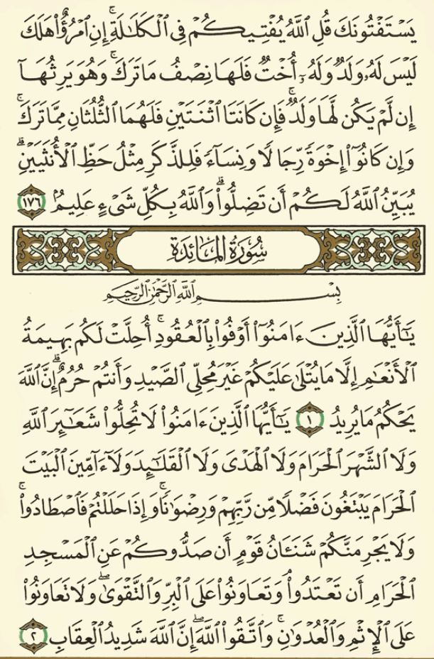
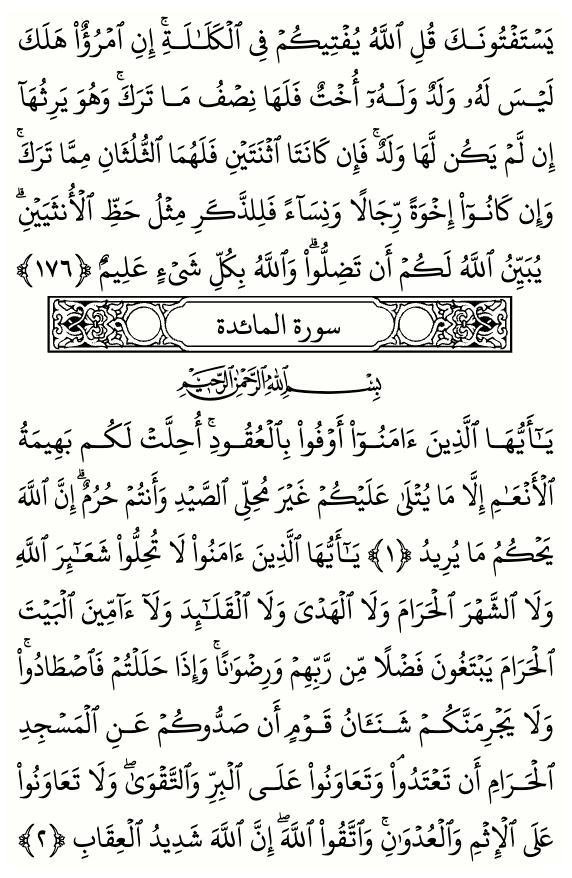
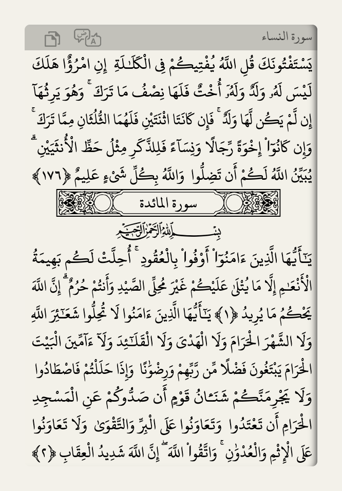
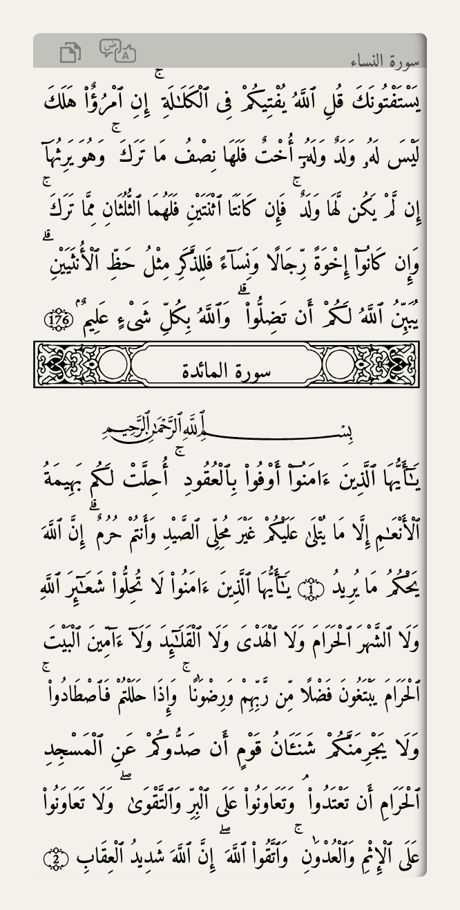
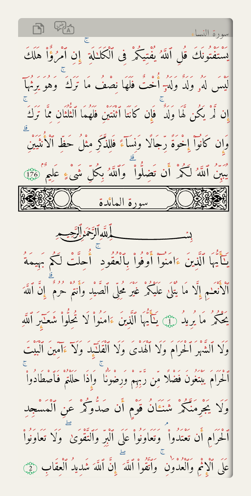
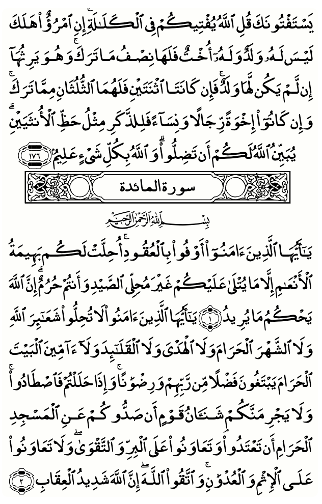
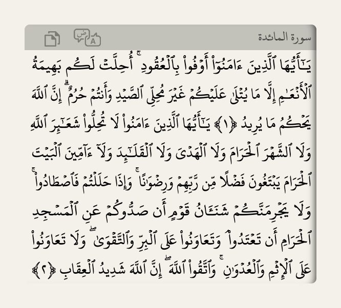
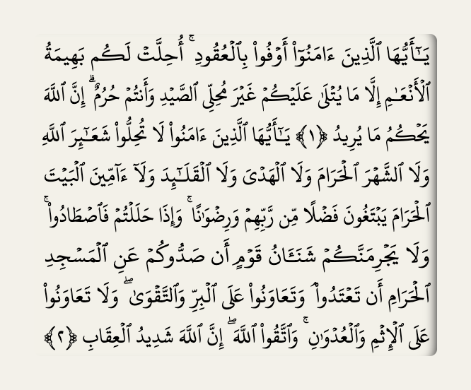
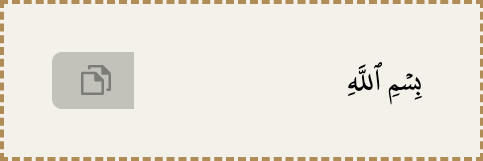
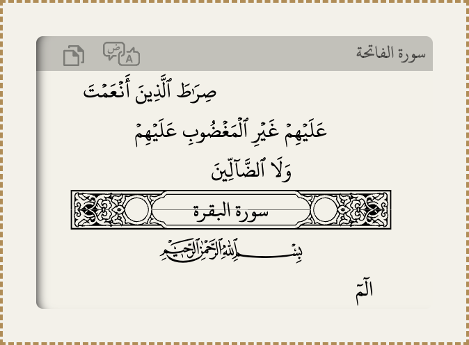

# Quran Madina Html (no-images)

[](https://github.com/tarekeldeeb/quran-madina-html/actions/workflows/github-code-scanning/codeql)
[](https://github.com/tarekeldeeb/quran-madina-html/actions/workflows/pylint.yml)
[](https://github.com/tarekeldeeb/quran-madina-html/actions/workflows/py_test.yml)
[](https://github.com/tarekeldeeb/quran-madina-html/actions/workflows/npm-grunt.yml)
[](https://socket.dev/npm/package/quran-madina-html)

A Quran renderer for the browser that looks like the printed Madina Mushaf — **without a single image**.
Every glyph is real, selectable, copy-pasteable text laid out with pure HTML/CSS, wrapped in one custom
element:

```html
<quran-madina-html sura="2" aya="255"></quran-madina-html>
```

**[See it live →](https://tarekeldeeb.github.io/quran-madina-html/demo/index.html)** (view the page source too —
GitHub strips `<script>` tags from this README, so the tag can't render *here*, but it's just as simple as
the snippet above once it's on your own page.)

## Why

* **Pixel-faithful to the printed Madina Mushaf** — same line breaks, same justification, same page layout.
* **Pure HTML/CSS, no images** — text stays selectable, searchable, and copy-pasteable; pages load fast.
* **One HTML tag** — no build step, no framework required.
* **Any font** — Hafs, Uthman, Amiri Quran (plain or tajweed-colored), or your own.
* **Word-level addressing** — render any word range, even across ayas, pages, and suras.

## See it in action

Page 106, rendered by the library next to a scan of the actual printed page:

<table>
<tr>
<td align="center"><br/>Printed Madina Mushaf</td>
<td align="center"><br/><code>&lt;quran-madina-html page="106"&gt;</code></td>
</tr>
</table>

### One engine, any font

The same JSON-driven layout engine re-flows for whichever font you point it at —
`data-font="Hafs"` (default), `Uthman`, `Amiri Quran`, `Amiri Quran Colored` (tajweed rules
color-coded), or the bundled `me_quran`.

<table>
<tr>
<td align="center"><br/>Hafs</td>
<td align="center"><br/>Uthman</td>
<td align="center"><br/>Amiri Quran</td>
</tr>
<tr>
<td align="center"><br/>Amiri Quran Colored</td>
<td align="center"><br/>me_quran</td>
<td></td>
</tr>
</table>

### Verse ranges — framed or frameless

`sura`/`aya` renders just the ayat you ask for, laid out exactly as they sit on the Madina page.
By default you get a header (sura name + copy/translate icons); add `headless="true"` to strip
that chrome and keep only the Quran text:

<table>
<tr>
<td align="center">

```html
<quran-madina-html sura="5" aya="1-2">
</quran-madina-html>
```


</td>
<td align="center">

```html
<quran-madina-html sura="5" aya="1-2"
  headless="true">
</quran-madina-html>
```


</td>
</tr>
</table>

### Word-level selection

The `words` attribute picks out a word range — 1-based, inclusive — and hides the rest of the
text *in place*, so the original Madina line justification is preserved instead of being
reflowed. Counting continues past the end of the given aya, so a selection can cross aya, page,
and even sura boundaries:

<table>
<tr>
<td align="center">

```html
<quran-madina-html sura="1" aya="1"
  words="1:2">
</quran-madina-html>
```

first two words of Al-Fatiha; the dashed
outline marks the hidden remainder of the line
<br/><br/>

</td>
<td align="center">

```html
<quran-madina-html sura="1" aya="7"
  words="1-14">
</quran-madina-html>
```

words 1-14 counted from Al-Fatiha's last aya
spill into Surat Al-Baqara — its basmala
counts as words 10-13
<br/><br/>

</td>
</tr>
</table>

## Getting Started

In your Html header, add this script:

```html
<script type="text/javascript" src="https://unpkg.com/quran-madina-html"></script>
```

* Supported ``data-name`` parameters are: Madina05 (default), others are under development (Shemerly, Qaloon, Newer Madina)
* Supported ``data-font`` parameters are: Hafs (default), Uthman, Amiri Quran, Amiri Quran Colored
* Other options include: ``data-font-size`` which defaults to 16 (px)

Then in your body, just add the tag.

```html
<quran-madina-html sura="2" aya="8-10"></quran-madina-html>
```

If the selected aya(s) fit on a single line, the default is to generate an inline ``<span>`` element, otherwise a ``<div>`` is generated.

You can also restrict the output to a specific word sequence with the ``words`` attribute (1-based, inclusive; ``start-end``, ``start:end`` or a single ``index``). Word indices are counted starting from the given ``sura``/``aya`` and may run past it, so the rendered selection can span multiple ayas — and even cross page and sura boundaries. When the selection crosses into a new sura, its **basmala counts as 4 real, individually selectable words** — matching the flat Tanzil word indexing most consumers count against (At-Tawba has none; Al-Fatiha's basmala is its real aya 1) — while the **sura title** stays uncounted decoration, shown for context only. Display follows the printed Mushaf: when **all 4** basmala words fall inside the selection (or on a full ``page`` render) they show as the traditional **﷽ ligature**; a partial selection (1–3 of the 4) renders the individual words. Either way the basmala occupies 4 word indices. The non-selected words are kept in place so the original Madina line layout is preserved — only the chosen words are shown. Aya-number markers are not counted.

> **Changed in 0.9.0:** the basmala used to be a *never counted* decoration; a cross-sura ``words``
> index now lands 4 words later than in 0.8.x.

```html
<quran-madina-html sura="1" aya="1" words="1:2"></quran-madina-html>  <!-- first two words only -->
<quran-madina-html sura="1" aya="1" words="3-10"></quran-madina-html> <!-- words 3..10, spanning ayas 1-3 -->
<quran-madina-html sura="1" aya="7" words="1-14"></quran-madina-html> <!-- spans Al-Fatiha into Al-Baqara:
                                                                           9 words + 4 basmala words + الٓمٓ -->
```

The ``words`` attribute is ignored when rendering a full ``page``.

To embed a selection inside your own chrome (e.g. a quiz that already labels the sura/aya), the ``notitle`` attribute hides the crossed-into sura's **name text** while keeping its decorated title line (the ornamental frame stays, empty) — and the basmala, being real counted words, still renders:

```html
<quran-madina-html sura="1" aya="7" words="1-14" notitle="true"></quran-madina-html>
```

Another option exists to render a complete quran page:

```html
<quran-madina-html page="106"></quran-madina-html>
```

By default a multiline render gets a header (sura name + copy/translate icons); clicking any aya (inline or multiline) opens a small copy/translate popup scoped to it. Set ``headless="true"`` to drop the header and render only the Quran text:

```html
<quran-madina-html sura="2" aya="8-10" headless="true"></quran-madina-html> <!-- no header -->
```

## Dev Setup

The project is published on npm ``npm install quran-madina-html``, with sources, assets and distributables.
Alternatively, you can fork this repo, then clone it.

```bash
apt install python3-distutils nodejs npm chromium-driver
npm install // install components and scripts
npm run build-db // build all json Db files
npm run release // build the dist with dependencies

```

## Demo

<https://tarekeldeeb.github.io/quran-madina-html/demo/index.html>

Don't forget to see the page source!

## Links

[X-Tags Docs](http://x-tags.org/docs)
